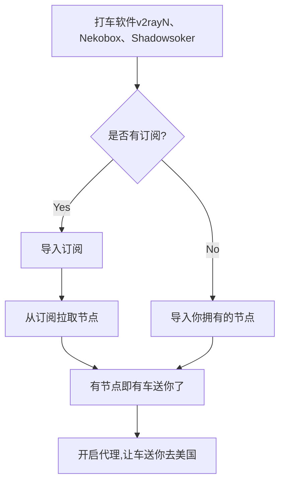
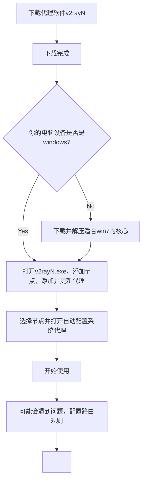
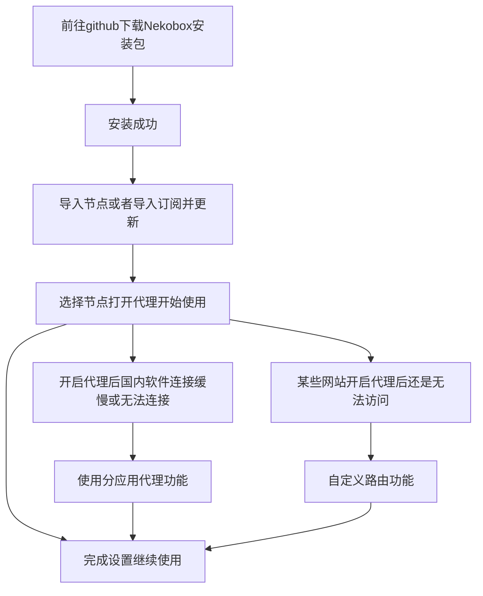
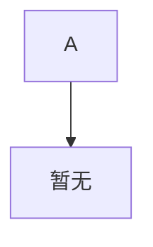

---
{"dg-publish":true,"permalink":"/魔法教程/翻墙软件使用教程/","tags":["gardenEntry"],"updated":"2025-08-08T10:52:34.688+08:00"}
---

> 本文是引导页与简单说明，具体使用教程请参照下面的链接：

## 请选择你的设备
- windows电脑 - [[魔法教程/翻墙软件v2rayN详细使用教程\|翻墙软件v2rayN详细使用教程]]
- 安卓手机 - [[魔法教程/翻墙软件Nekobox详细使用教程\|翻墙软件Nekobox详细使用教程]]
- 苹果手机 - [[魔法教程/翻墙软件Shadowsoker详细使用教程\|翻墙软件Shadowsoker详细使用教程]]

---

开始前请先理解几个简单的概念:
1. 节点 - 类似于载你的车，美国节点就是载你来回美国的车
2. 订阅 - 一群载你的车，通过更新订阅就可以获得一群车的信息
3. 协议 - 载你的车的类型，比亚迪还是宝马还是老头乐
4. 核心 - 车里面的发动机
5. 代理软件 - 也就是v2rayN、Nekobox等，类似于打车软件

一个正常的流程是这样的:

不同的设备，例如手机电脑、安卓苹果使用的代理软件(打车软件)都不一定一样，每一个软件的功能或多或少的也有一些区别，但是总体的逻辑是一样的。

---
### windows电脑使用代理软件流程图

点击跳转[v2rayN详细教程](翻墙软件v2rayN详细使用教程)

---
### 安卓手机使用代理软件流程图

点击跳转[Nekobox详细教程](翻墙软件Nekobox详细使用教程)

### 苹果手机使用代理软件流程图

点击跳转[Shadowsoker详细教程](翻墙软件Shadowsoker详细使用教程)

---
## 其他常见问题
暂无